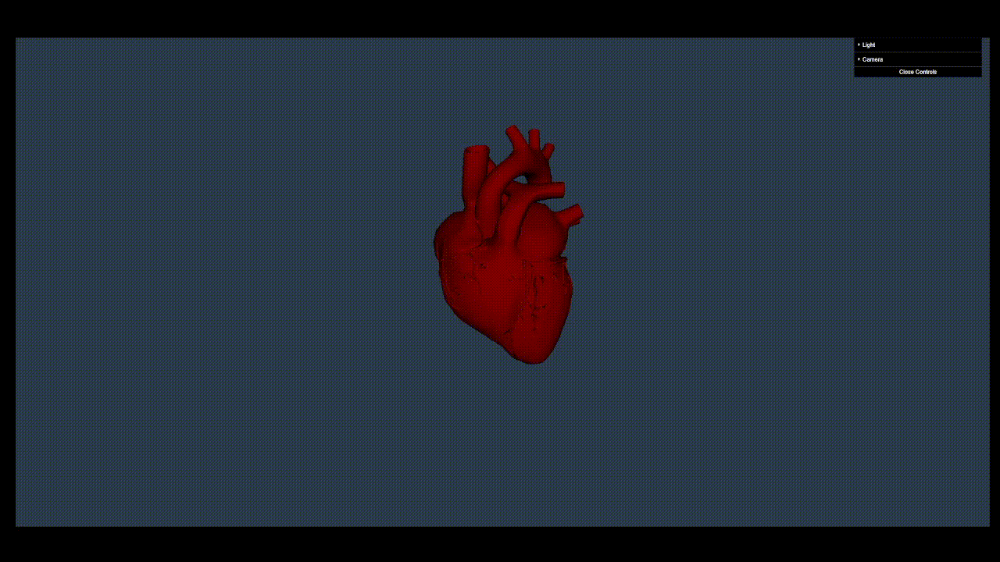

# Heart.js

## Sample Preview


## Docker Setup

Download [Docker](https://www.docker.com/products/docker-desktop).
Run this followed commands:

``` bash
# Build the docker image
docker build -t heart.js .

# Run the docker container
docker run -p 8080:8080 heart.js
```

## Local Development Setup

Download [Node.js](https://nodejs.org/en/download/).
Run this followed commands:

``` bash
# Install dependencies (only the first time)
npm install

# Run the local server at localhost:8080
npm run dev

# Build for production in the dist/ directory
npm run build
```
